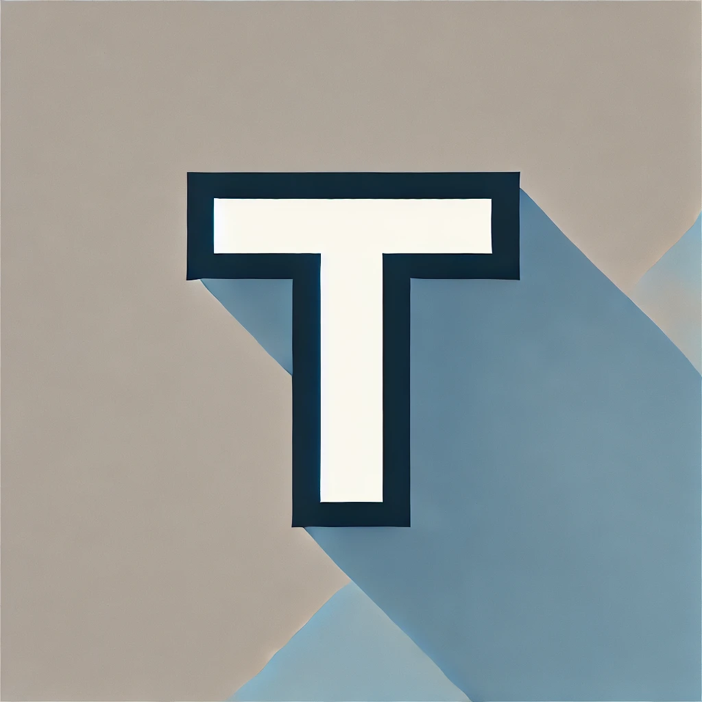

| before | after |
| --- | --- |
|  |  |

Table of Contents

- [Generated an image for the favicon using ChatGPT](#generated-an-image-for-the-favicon-using-chatgpt)
- [Cropped, resized, and created an ICO file with six image sizes using ImageMagick](#cropped-resized-and-created-an-ico-file-with-six-image-sizes-using-imagemagick)
- [Checked the binary data of the ICO file](#checked-the-binary-data-of-the-ico-file)

## Generated an image for the favicon using ChatGPT

I used GPT-4o to generate a new favicon.

The prompt is as follows, and it was generated and refined using GPT-4o. I iterated on the prompt based on feedback and revisions to achieve the desired outcome:

```
Create a design according to the following strict requirements:

1. Draw the letter "T" directly on the entire background. The shape of the "T" must be clear and highly recognizable, and this should be the top priority.
2. Do not alter or distort the outline or shape of the "T," nor cover it with decorations. The letter itself should be the centerpiece of the design, maintaining its correct shape.
3. Place the "T" prominently and centrally on the background so it stands out clearly. Ensure that the background or any accents do not obscure or encroach upon the "T."
4. Do not add any other elements (e.g., shapes, patterns, icons, or additional decorations) aside from the "T."
5. The design must be completely flat. **Do not include any shadows of any kind** (e.g., drop shadows, cast shadows, or soft glows) on or around the "T" or the background. **Shadow effects are strictly prohibited.**
6. Keep the background solid-colored and avoid any patterns, textures, or glossy effects.
7. The design should be simple and clear, ensuring that the "T" remains recognizable even when scaled down.

The design size should be 1024x1024 pixels to ensure clarity even when resized.
```

The generated image is here.



## Cropped, resized, and created an ICO file with six image sizes using ImageMagick

The "T" appeared slightly small relative to the entire image, so I cropped the image slightly while maintaining the center.

I use a Mac, but I wasn't sure how to crop the image to a square without changing the center, so I used ImageMagick and operated through the CLI.

```
brew install imagemagick
```

```
magick favicon_original.webp -gravity Center -crop 700x700+0+0 favicon_700x700.webp
```


I was satisfied with the size of the "T," but the 700x700 image was too large for a favicon, so I resized it.

[Favicon: Formats, Sizes, Use Cases, and Best Practices](https://favicon.im/blog/favicon-formats-sizes-best-practices) on Favicon.im provides a clear summary of sizes and their purposes:

> - 16x16 pixels: Standard size for browser tabs and address bars.
> - 32x32 pixels: For higher resolution displays and Windows taskbar.
> - 48x48 pixels: Used by some desktop browsers.
> - 64x64 pixels: For Windows site icons.
> - 152x152 pixels: For iOS home screen icons.
> - 192x192 pixels: For Android home screen icons.
> - 512x512 pixels: For PWA (Progressive Web App) splash screens.

The favicon I'm creating is for this website, not a PWA, so I prepared images for the other sizes.

```
magick favicon_700x700.webp -resize 16x16 favicon-16.webp; \
magick favicon_700x700.webp -resize 32x32 favicon-32.webp; \
magick favicon_700x700.webp -resize 48x48 favicon-48.webp; \
magick favicon_700x700.webp -resize 64x64 favicon-64.webp; \
magick favicon_700x700.webp -resize 152x152 favicon-152.webp; \
magick favicon_700x700.webp -resize 192x192 favicon-192.webp;
```

And then, combine these into an ICO file. Until doing some research for this favicon refresh, I didn't know ICO files can contain multiple images. I couldn't find definitive documentation, but browsers and the OS should ideally select the optimal image. I'll touch on this in the section [Checked the binary data of the ICO file](#checked-the-binary-data-of-the-ico-file).

```
magick favicon-16.webp favicon-32.webp favicon-48.webp favicon-64.webp favicon-152.webp favicon-192.webp favicon.ico
```

This created the favicon.ico file. I also wanted to dive into the point that ICO files can contain multiple images, something I learned for the first time. Let's compare the images stored in the old and new favicon.ico files.

Old favicon.ico

```
magick identify favicon.ico
favicon.ico[0] ICO 16x16 16x16+0+0 8-bit sRGB 0.000u 0:00.001
favicon.ico[1] ICO 32x32 32x32+0+0 8-bit sRGB 0.000u 0:00.001
favicon.ico[2] ICO 48x48 48x48+0+0 8-bit sRGB 15406B 0.000u 0:00.00
```

New favicon.ico

```
magick identify favicon.ico
favicon.ico[0] ICO 16x16 16x16+0+0 8-bit sRGB 0.000u 0:00.006
favicon.ico[1] ICO 32x32 32x32+0+0 8-bit sRGB 0.000u 0:00.007
favicon.ico[2] ICO 48x48 48x48+0+0 8-bit sRGB 0.000u 0:00.007
favicon.ico[3] ICO 64x64 64x64+0+0 8-bit sRGB 0.000u 0:00.007
favicon.ico[4] ICO 152x152 152x152+0+0 8-bit sRGB 0.000u 0:00.006
favicon.ico[5] ICO 192x192 192x192+0+0 8-bit sRGB 279670B 0.000u 0:00.004
```

The new version contains six images (compared to just three in the old version, only).

## Checked the binary data of the ICO file

On my website, the favicon.ico file is placed in the root directory, and I don't use a `<link>` tag with the `sizes` attribute as specified in [4.6.7.9 Link type "icon" of the HTML Standard](https://html.spec.whatwg.org/multipage/links.html#rel-icon). Therefore, the sizes of the images are not explicitly specified. However, I expect the optimal image within the favicon.ico file to be automatically selected, and ChatGPT also confirmed that the optimal image would be selected automatically. That said, I think it's because ICO is somewhat an old format, I couldn't find clear documentation to confirm this behavior.

To check this for myself, I revisited [ICO (file format)](https://en.wikipedia.org/wiki/ICO_(file_format)), which explains the structure of ICO files. I used the `xxd` command to output the binary data in hexadecimal format and reviewed it. This was my first time viewing binary data, while this is converted to hexadecimal format.

```
xxd favicon.ico | head -7
00000000: 0000 0100 0600 1010 0000 0100 2000 6804  ............ .h.
00000010: 0000 6600 0000 2020 0000 0100 2000 a810  ..f...  .... ...
00000020: 0000 ce04 0000 3030 0000 0100 2000 a825  ......00.... ..%
00000030: 0000 7615 0000 4040 0000 0100 2000 2842  ..v...@@.... .(B
00000040: 0000 1e3b 0000 9898 0000 0100 2000 0875  ...;........ ..u
00000050: 0100 467d 0000 c0c0 0000 0100 2000 2852  ..F}........ .(R
00000060: 0200 4ef2 0100 2800 0000 1000 0000 2000  ..N...(....... .
```

For more details, it's quickest to refer to the aforementioned [ICO (file format)](https://en.wikipedia.org/wiki/ICO_(file_format)) on Wikipedia. Here, I'd like to write about the process I followed to check the sizes of the individual images that caught my attention.

An ICO file starts with a header that contains predefined information. Quoting from [The evolution of the ICO file format, part 1: Monochrome beginnings](https://devblogs.microsoft.com/oldnewthing/20101018-00/?p=12513), the header of an ICO file is structured as follows:

```
typedef struct ICONDIR {
    WORD          idReserved;
    WORD          idType;
    WORD          idCount;
    ICONDIRENTRY  idEntries[];
} ICONHEADER;
```

Using the actual values output by the earlier `xxd` command, let's break it down. The first 6 bytes, `00 00 01 00 06 00`, are interpreted in pairs, each holding specific meanings. At offsets 4 and 5 (`06 00`), the number of images stored in the ICO file is indicated.

Specifically, `0x0600` (`0x` is a prefix that indicates the number is in hexadecimal format) represents the number of images in this ICO file. Since all values are stored in little-endian byte order, this is interpreted as `0x006` in hexadecimal. And converting this to decimal gives 6, meaning the file contains 6 images.

Following `idCount`, there are as many ICONDIRENTRY structures as the number of images. Each ICONDIRENTRY is 16 bytes long and is structured as follows, as referenced again from [The evolution of the ICO file format, part 1: Monochrome beginnings](https://devblogs.microsoft.com/oldnewthing/20101018-00/?p=12513).

```
struct IconDirectoryEntry {
    BYTE  bWidth;
    BYTE  bHeight;
    BYTE  bColorCount;
    BYTE  bReserved;
    WORD  wPlanes;
    WORD  wBitCount;
    DWORD dwBytesInRes;
    DWORD dwImageOffset;
};
```

From the `xxd` output, breaking down each 16-byte entry:

ICONDIRENTRY structure

```
1010 0000 0100 2000 6804 0000 6600 0000
2020 0000 0100 2000 a810 0000 ce04 0000
3030 0000 0100 2000 a825 0000 7615 0000
4040 0000 0100 2000 2842 0000 1e3b 0000
9898 0000 0100 2000 0875 0100 467d 0000
c0c0 0000 0100 2000 2852 0200 4ef2 0100
```

As mentioned earlier in the Wikipedia article on [ICO (file format)](https://en.wikipedia.org/wiki/ICO_(file_format)), offset 0 in the ICONDIRENTRY structure specifies the image width in pixels, while offset 1 specifies its height. Let's take a closer look at offsets 0 and 1 in each ICONDIRENTRY structure.

```
[Image #1] 10 10 -> 0x10 (16 decimal) each => Width 16px, Height 16px
[Image #2] 20 20 -> 0x20 (32 decimal) each => Width 32px, Height 32px
[Image #3] 30 30 -> 0x30 (48 decimal) each => Width 48px, Height 48px
[Image #4] 40 40 -> 0x40 (64 decimal) each => Width 64px, Height 64px
[Image #5] 98 98 -> 0x98 (152 decimal) each => Width 152px, Height 152px
[Image #6] c0 c0 -> 0xc0 (192 decimal) each => Width 192px, Height 192px
```

Based on this information, it appears that browsers or the OS render the optimally sized image.

On a side note, I tried rounding the favicon but decided against it.

```
magick favicon_original.webp \( +clone -alpha transparent -background none -draw "roundrectangle 0,0,700,700,145,145" \) -alpha set -compose DstIn -composite rounded_rounded.webp
```
